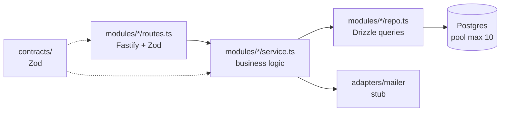

# TypeScriptDemo — test fixture specification

> **Summary.** Write four handoff markdown specs under `docs/typescript-demo/` that specify a
> deliberately small Fastify 5 + Drizzle/Postgres + Zod task-tracker fixture (~28 files) plus six
> calibrated pull requests with planted defects, so a separate agent can build the repo and
> DevDigest can be benchmarked against a known answer key.
>
> File paths in parentheses refer to the DevDigest source tree and are the evidence behind each
> constraint.

## Goal of this plan

Produce **markdown specs only**, in this repo, under `docs/typescript-demo/`. No application code is written here. A separate agent, in a fresh repo, will read these specs and build the app plus the pull requests.

The output is a benchmark, not just a demo app: a clean baseline plus six pull requests whose defects are known in advance, so DevDigest's output can be scored for recall (did it find the planted defects), precision (did it invent extras), and grounding (did real findings survive the gate).

## Scope guard: this app stays small

The app is a **test fixture**, not a product. Its only job is to be a plausible-looking host for six diffs. The specs will open with this as a binding rule, because the natural failure mode of handing a spec to a building agent is that it builds a real application.

Sizing target for `main`: **about 28 files and 1400 lines.** That is enough for a real import graph, PageRank, and a useful callers digest, and it is far under every indexer cap.

The lever that makes this small: **anything a PR introduces does not need to exist in `main`.** Analytics, API keys, webhooks, and the audit log are all created *by* PRs 3, 4, and 5, so none of them belong in the baseline. `main` needs only the seven modules the PRs *modify*.

Explicit non-goals, to be listed in the specs so the building agent does not add them: no frontend or UI, no real authentication provider, no rate limiting, no OpenAPI or docs generation, no CI workflows, no logging or monitoring integrations, no file storage, no Dockerfile, no deployment config, no seed or fixture data beyond what a test needs, and no attempt to make the app actually runnable against a live database. The LLM adapter used by optional PR 7 is a stub that returns a canned string.

Tests exist only to make the `test` finding category reachable and to prove the baseline compiles: roughly four small test files, happy path only, no integration or e2e tests.

## Hard constraints discovered in DevDigest

These drive every design choice below, so the specs will state them explicitly for the building agent.

- **Only `.ts .tsx .js .jsx .mjs .cjs` are indexed.** `MAX_INDEXED_FILES = 5000`, `MAX_FILE_SIZE = 400 KB` ([server/src/modules/repo-intel/constants.ts](server/src/modules/repo-intel/constants.ts)).
- **The stack in the prompts is the stack we must build.** All three seeded reviewers assume Node + TypeScript ESM + Fastify 5 + Drizzle/Postgres + Zod + Octokit ([server/src/db/seed-prompts.ts](server/src/db/seed-prompts.ts)).
- **Grounding is a hard gate.** A finding survives only if its file path matches the diff's `+++ b/<path>` exactly and `[start_line, end_line]` intersects a hunk's new-side lines ([reviewer-core/src/grounding.ts](reviewer-core/src/grounding.ts)). Consequence: every planted defect must sit on an **added or modified line, inside a small hunk**. No defects in deleted files, binary files, or untouched context.
- **The model gets no line numbers** — it reads a raw unified diff and counts forward from `@@` headers ([reviewer-core/src/prompt.ts](reviewer-core/src/prompt.ts)). Consequence: keep flawed functions short so its line guess lands inside the covered range.
- **Scoring is deterministic and ignores the model:** `100 − 35×CRITICAL − 12×WARNING − 3×SUGGESTION`, clamped 0–100, computed *after* grounding ([reviewer-core/src/review/reduce.ts](reviewer-core/src/review/reduce.ts)).
- **Strategy `auto` picks map-reduce only when total changed lines > 400 AND files > 1** ([reviewer-core/src/review/run.ts](reviewer-core/src/review/run.ts)). Default is `single-pass`.
- **A root `tsconfig.json` is required** for dependency-cruiser to resolve path aliases; without it the import graph, PageRank, and repo map all degrade.
- **Default branch must be `main`** — DevDigest hardcodes `'main'` and never reads it from GitHub.
- **The injection guard neutralizes "this is a test fixture" disclaimers**, so the repo can be labeled honestly without suppressing findings. The answer key still stays out of the demo repo.
- Keep each PR under 100 changed files (`listFiles` uses `per_page: 100`, unpaginated).

## The application

A multi-tenant task-tracker API. Multi-tenancy is deliberate: "missing workspace/tenant scope" is called out by name in both the general and security prompts, and it is the single most valuable defect class to test.

- Repo `typescript-demo`, ESM, Node 22, pnpm, path alias `@app/* -> src/*`.
- Layout mirrors DevDigest's own conventions so `repo-intel` produces a meaningful graph: `src/platform/` (config, errors, jobs), `src/db/schema/` (one file per table) + `src/db/migrations/`, `src/modules/<domain>/{routes,service,repo}.ts`, `src/adapters/mailer/`, `src/contracts/` for Zod contracts.
- **Seven modules in `main`**, chosen because these are the ones the PRs modify: `auth`, `workspaces`, `projects`, `tasks`, `comments`, `notifications`, `health`.
- **Six tables in `main`**: `workspaces`, `users`, `memberships` (carries `role`, needed for PR 5's privilege escalation), `projects`, `tasks`, `comments`.
- **Created by PRs, absent from `main`**: `audit_log` (PR 3), analytics/reports (PR 4), `api_keys` and `webhooks` (PR 5), the AI summarizer (optional PR 7).
- Fidelity: typechecks and unit tests pass. A `docker-compose.yml` for Postgres is included for plausibility but is never run.

### Baseline quality bar for `main`

The prompts instruct the model to flag only what **this diff** introduced, so a noisy baseline would wreck the signal. `main` must be deliberately correct: every query tenant-scoped, all SQL parameterized, every promise awaited, an index behind every filtered column, API keys hashed with a timing-safe compare, auth failing closed, no unbounded list endpoints, and passing tests. The specs will state this as an explicit checklist the building agent verifies before opening any PR.

## The six pull requests

Each is an independent branch off `main` (all six open simultaneously; DevDigest lists with `state: 'all'`). Each has a plausible title and body, with defects embedded naturally rather than signposted.

- **PR 1 — `chore/task-pagination`: clean control.** Pagination and sorting on `GET /projects/:id/tasks`, done correctly: capped limit in the Zod schema, indexed sort column, tests added. ~80 lines, 4 files. Expected `approve`, 0 findings, score 100. This measures the false-positive rate — a CRITICAL here means the agent is too aggressive.

- **PR 2 — `fix/overdue-filter`: subtle correctness, no security.** Plants an empty-array truthiness trap (`if (!rows) throw NotFound` never fires, so not-found fails open to an empty list), `||` instead of `??` collapsing a meaningful `limit: 0`, an off-by-one offset (`page * limit`), a date compared as a `YYYY-MM-DD` string against `timestamptz`, and one `it.skip` on an existing test. ~60 lines, 3 files. Expected 1 CRITICAL + 2 WARNING + 1 SUGGESTION, categories `bug` / `test`. Tests whether the general reviewer catches non-security logic bugs *without* inflating them.

- **PR 3 — `feat/bulk-import`: async and error handling.** `items.forEach(async …)` so the response returns before inserts finish, a missing `await` on an audit write inside a transaction, sequential awaits instead of a batch insert, an empty `catch {}` reporting success on partial failure, and no cap on `items.length`. ~120 lines, 4 files. Expected 1 CRITICAL + 3 WARNING, categories `bug` / `perf` / `test`.

- **PR 4 — `feat/analytics-dashboard`: performance.** A nested N+1 (projects → tasks → comments), over-fetching then filtering in JS, a migration that adds a filtered column but no index, an O(n²) in-memory join, an unpaginated list endpoint, and — the CRITICAL — a `db.transaction()` that holds a connection across an outbound `fetch()` with a pool of 10. ~140 lines, 5 files. Expected 1 CRITICAL + 4 WARNING + 1 SUGGESTION, category `perf`. Also the best agent-differentiation test: the Performance reviewer should clearly outperform the General one here.

- **PR 5 — `feat/api-key-auth`: security, saturated.** Adds the `api_keys` and `webhooks` tables plus a task-search filter. Seven OWASP-mapped defects: a task lookup by id with no `workspaceId` filter (cross-tenant read, A01), API keys stored as SHA-1 with a `===` compare (A02), `sql.raw` string interpolation in the new search filter (A03), webhook `fetch()` on a user-supplied URL with no allowlist (A10, SSRF), a `?? 'dev-secret-change-me'` JWT fallback, `.set(req.body)` mass assignment allowing `role: 'owner'` on `memberships`, and a preHandler that logs and returns on error so the request proceeds unauthenticated. ~160 lines, 6 files. Expected `request_changes`, score 0, CI gate tripped. Score saturates, so the metric here is **recall out of a known list of seven**.

- **PR 6 — `refactor/notification-service`: large, cross-file, strategy experiment.** Deliberately > 400 changed lines across ~7 files so `auto` selects map-reduce. The headline defect is only visible across two files: `sendDigest()` changes signature in `notifications/service.ts` while one call site in `tasks/service.ts` is left stale. Plus a response shape drifting from its Zod contract, a check-then-insert TOCTOU with no unique constraint, and a `setInterval` cron with no overlap guard or error boundary. Expected 1 CRITICAL + 4 WARNING. Run this PR three times — `single-pass`, `map-reduce`, `auto` — to demonstrate that map-reduce cannot see cross-file breakage, and to check whether repo-intel's "Callers of changed symbols" digest rescues it.

### Two optional extras (cheap, high signal)

- **PR 7 — `feat/ai-task-summarizer`: lethal trifecta.** Task comments (untrusted input) are fed to an LLM alongside workspace data (private data) and the result is posted to a user-configurable webhook (exfil path). This is the only way to exercise `kind: 'lethal_trifecta'` with `trifecta_components` and `evidence`, and it takes the grounding-exempt `FULL_FILE_KINDS` path.
- **PR 8 — docs and config only.** A PR touching only `.md` and `.json`. Expects `approve` with 0 findings; verifies sane behavior when nothing indexable changed.

## Files to write

Four documents under `docs/typescript-demo/`, self-contained so they can be handed to the building agent. Four rather than six, to match the reduced scope — an oversized spec set invites an oversized app.

- `00-OVERVIEW.md` — the scope guard and non-goals first, then the fixture's purpose, the DevDigest constraint list above, and the handoff instructions.
- `01-APP-SPEC.md` — the complete baseline: seven modules, six tables with their columns and indexes, every endpoint, the folder layout, and the contents of `package.json` / `tsconfig.json` / `vitest.config.ts` / `drizzle.config.ts`. Ends with the **baseline quality bar**: the correctness checklist `main` must satisfy (tenant-scoped queries, parameterized SQL, awaited promises, an index per filtered column, auth failing closed) with a short correct-vs-incorrect example per rule, plus the gate that typecheck and tests must be green before any PR branch is cut.
- `02-PR-CATALOG.md` — per PR: branch name, title, body text, files touched, approximate diff size, and each planted defect with its file, intended severity, category, and kind, plus why it is groundable.
- `03-ANSWER-KEY.md` — expected verdict, score, and finding counts per PR; which agent should catch which defect; and the four experiments (false-positive check on PR 1, agent differentiation on PR 4, recall on PR 5, strategy comparison on PR 6). **Stays in this repo — never copied into the demo repo**, so it cannot leak into a diff or the repo map.

## Verification

Since no code is produced in this step, verification is a self-consistency review of the specs: every planted defect maps to a line the grounding gate will accept; every expected score matches the deterministic formula applied to its finding counts; every defect class named in the specs traces back to a specific instruction in the seeded prompts; and the five finding categories (`bug`, `security`, `perf`, `style`, `test`) are all covered at least once across the set.

## Task checklist

- [ ] **`00-OVERVIEW.md`** — lead with the scope guard and non-goals (test fixture only, ~28 files, no UI/CI/deploy/runnable-DB), then fixture purpose, the DevDigest constraint list (indexer extensions, grounding gate, scoring formula, strategy thresholds, tsconfig/main-branch requirements), and handoff instructions.
- [ ] **`01-APP-SPEC.md`** — the 7 baseline modules, 6 tables with columns and indexes, endpoints, folder layout, config file contents, and the baseline quality bar checklist with correct-vs-incorrect examples plus the typecheck/test gate.
- [ ] **`02-PR-CATALOG.md`** — the 6 core PRs plus 2 optional, each with branch, title, body, files touched, diff size, and every planted defect with intended severity/category/kind and its groundability rationale.
- [ ] **`03-ANSWER-KEY.md`** — expected verdict/score/finding counts per PR, per-agent expectations, and the four benchmark experiments; note it must stay out of the demo repo.
- [ ] **Self-consistency pass** — verify every defect is groundable, every expected score matches the deterministic formula, every defect class traces to a seeded prompt instruction, all five finding categories are covered, and nothing a PR introduces was built into `main`.
