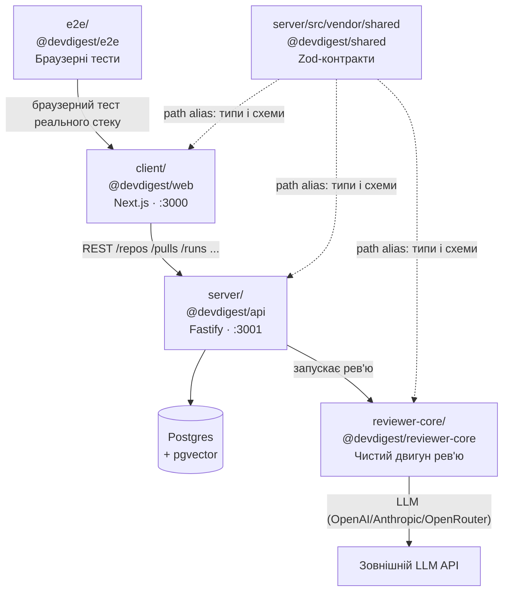

# DevDigest — пояснення проєкту

> Документ написано українською для першого знайомства з кодовою базою.  
> Технічні терміни пояснюються в дужках при першій згадці.

---

## 1. Що це за проєкт?

**DevDigest** — локальний інструмент для автоматичного рев'ю (перевірки) пул-реквестів (PR — пропозиція змін у коді) за допомогою AI. Принцип роботи:

1. Додаєш GitHub-репозиторій (сховище коду) → система клонує його та індексує структуру.
2. Імпортуєш PR з GitHub → система завантажує diff (різницю між старим і новим кодом).
3. Запускаєш "агента" → він читає diff, збирає контекст коду і просить LLM (велику мовну модель — ChatGPT, Claude тощо) проаналізувати зміни.
4. Отримуєш структуровані знахідки: кожна має severity (рівень серйозності: CRITICAL / WARNING / SUGGESTION), файл, рядки, пояснення та пропозицію виправлення.

> **Важливо:** це навчальний _starter-шаблон_ курсу. У стартовій версії реалізовано один сценарій end-to-end (від початку до кінця). Кожен урок курсу додає нові можливості.

---

## 2. Що таке "мульти-пакетний monorepo-style"?

### Monorepo (монорепозиторій)

**Monorepo** = один Git-репозиторій, що містить кілька самостійних проєктів (пакетів).  
Протилежність — окремий репозиторій для кожного проєкту.

**Переваги:** легше шарити спільний код, зміни в одному пакеті одразу видно іншим, єдина CI/CD (система автоматичної перевірки коду).

### Чому "style", а не справжній monorepo?

У справжніх monorepo зазвичай є **workspaces** (pnpm/npm workspaces) — єдиний файл залежностей і спільний `node_modules`. Тут кожен пакет має **власний `package.json`** і власний `node_modules`. Пакети не публікуються — між ними немає реальних імпортів через npm. Натомість код шариться через **TypeScript path aliases** (псевдоніми шляхів у `tsconfig.json`): наприклад, `@devdigest/shared` — це просто псевдонім для папки `server/src/vendor/shared`, і TypeScript "знає" де шукати файли.

```
// tsconfig.json (спрощено)
{
  "paths": {
    "@devdigest/shared/*": ["../server/src/vendor/shared/*"],
    "@devdigest/reviewer-core/*": ["../reviewer-core/src/*"]
  }
}
```

### Схема залежностей між пакетами



---

## 3. Для чого кожна головна папка?

### Кореневий рівень

- **`server/`** (`@devdigest/api`) — бекенд (серверна частина). Написаний на **Fastify** (швидкий Node.js-фреймворк для HTTP-сервера). Зберігає дані в **Postgres** через **Drizzle ORM** (ORM — бібліотека для роботи з базою даних на TypeScript замість ручних SQL-запитів). Запускається на порту **3001**.

- **`client/`** (`@devdigest/web`) — фронтенд (веб-інтерфейс). Написаний на **Next.js 15** + **React 19**. Це те, що відкриваєш у браузері. Запускається на порту **3000**.

- **`reviewer-core/`** (`@devdigest/reviewer-core`) — "чистий двигун рев'ю". Містить лише логіку: diff → промпт → LLM → знахідки. Без бази даних, без мережевих з'єднань (крім LLM). Підключається до `server/` і до CI-агента через path alias. "Чистий" = його легко тестувати і переносити.

- **`e2e/`** (`@devdigest/e2e`) — end-to-end (наскрізні) браузерні тести. Перевіряють всю систему цілком через браузер, без LLM (детерміновані).

- **`docs/`** — додаткова документація та діаграми.

- **`scripts/`** — shell-скрипти для запуску проєкту (`dev.sh`).

- **`.github/`** — конфігурація GitHub Actions (CI — автоматичний запуск тестів при кожному push).

- **`.claude/skills/`** — навчальні матеріали та правила для AI-асистентів (Cursor, Claude). Не є частиною коду продукту.

### Всередині `server/src/`

- **`modules/`** — бізнес-логіка, розбита по темах:
  - `agents/` — CRUD (Create/Read/Update/Delete) агентів.
  - `reviews/` — запуск рев'ю, збереження знахідок, стрімінг прогресу.
  - `pulls/` — імпорт та перегляд PR.
  - `repos/` — управління репозиторіями.
  - `repo-intel/` — **індексатор коду**: парсить символи (функції, класи), будує граф імпортів → "repo map" (карта коду). Використовує `ast-grep` (пошук за AST — деревом синтаксису) і `graphology` (граф-бібліотека).
  - `agents/`, `polling/`, `settings/`, `workspace/` — відповідні домени.

- **`adapters/`** — "перехідники" до зовнішніх систем: `github/` (Octokit SDK), `llm/` (OpenAI, Anthropic, OpenRouter), `git/` (simple-git), `astgrep/`, `embedder/`, `depgraph/`, `codeindex/`.

- **`db/`** — схема таблиць Drizzle + SQL-міграції (скрипти, що змінюють структуру БД).

- **`vendor/shared/`** — спільні Zod-схеми (контракти) для всіх пакетів.

- **`platform/`** — dependency injection (контейнер залежностей) — центральне місце, де "збираються" всі адаптери та сервіси.

- **`prompts/`** — системні промпти для LLM.

---

## 4. Як визначаються "агенти"?

### Коротка відповідь: НЕ LangChain і НЕ LangGraph

У проєкті **нема жодного рядка** LangChain, LangGraph або будь-якого AI-фреймворку оркестрації. Пошук `langchain` і `langgraph` по всьому репо повертає 0 результатів.

Єдині LLM-бібліотеки:
- `openai` — офіційний SDK для OpenAI та OpenRouter.
- `@anthropic-ai/sdk` — офіційний SDK для Claude (Anthropic).

Вся логіка оркестрації (збірка промпта, виклик LLM, повторні спроби, зведення результатів) написана **вручну**.

### Що таке "агент" у цьому проєкті?

Агент — це просто **рядок у таблиці бази даних** `agents` ([server/src/db/schema/agents.ts](server/src/db/schema/agents.ts)). Це **конфігурація**, а не автономна програма.

#### Чим це відрізняється від LangChain-агента?

У LangChain агент — це **цикл з вибором дій**:

```python
agent = create_agent(model="gemini-3.5-flash", tools=tools)
agent.run("Review this PR")
# → LLM сам думає: яку функцію викликати? скільки разів? коли зупинитись?
```

Внутрішній цикл LangChain-агента:
```
LLM думає → вибирає інструмент → виконує → дивиться на результат
  → LLM думає знову → вибирає інструмент → ...
    → LLM вирішує: "я готовий" → зупиняється
```

LLM **сам керує** планом дій. Це і є "автономний агент".

У DevDigest — **фіксований пайплайн** (послідовність кроків), і агент лише заповнює змінні місця в ньому:

```
# Концептуально:
agent_config = db.get_agent(id)  # { model, system_prompt, strategy, skills }

result = fixed_pipeline(
    system_prompt = agent_config.system_prompt,  # ← змінюється
    model         = agent_config.model,          # ← змінюється
    strategy      = agent_config.strategy,       # ← змінюється
    diff          = pr.diff,
)
# → pipeline фіксований, LLM лише генерує JSON за схемою
```

Єдине "розгалуження" у пайплайні — вибір стратегії, і це звичайний `if` в TypeScript, а не рішення LLM:

```
diff великий і багато файлів?
  ТАК → N LLM-викликів (по одному на файл) → злити результати
  НІ  → один LLM-виклик на весь diff
```

**Коротко:** LLM у DevDigest не вирішує "що робити далі". Він отримує diff, повертає JSON з полями `verdict` і `findings[]`. Крапка. Слово "агент" тут — UX-термін для "профіль рецензента" (назва + модель + системний промпт).

#### Аналогія

- **LangChain-агент** = кухар, якому дали продукти і він сам вирішує що приготувати, яку техніку використати.
- **DevDigest-агент** = рецепт. Кроки завжди одні й ті ж. Міняється тільки набір спецій (системний промпт) і марка плити (модель).

---

Поля агента:

| Поле | Що означає | Приклад |
|---|---|---|
| `name` | Назва | "Security Reviewer" |
| `provider` | Постачальник LLM | `openai` / `anthropic` / `openrouter` |
| `model` | Конкретна модель | `gpt-4o`, `claude-3-5-sonnet` |
| `system_prompt` | Системний промпт — головна інструкція для LLM | "Ти рев'юер коду. Шукай вразливості..." |
| `strategy` | Стратегія: `single-pass` (один виклик) або `map-reduce` (по файлах, потім зводить) | `auto` |
| `ci_fail_on` | Коли провалювати CI | `critical` |
| `repo_intel` | Використовувати карту коду | `true` |

Агент також може мати прив'язані **skills** (навички) — додатковий текст (конвенції проєкту, правила), який вставляється в промпт.

### Потік рев'ю

```mermaid
flowchart LR
    trigger["HTTP POST\n/pulls/:id/review"]
    reviewService["ReviewService\nСтворює run-записи в БД,\nповертає runIds одразу"]
    loadDiff["Завантаження diff\n(GitHub API або git)"]
    runExecutor["run-executor.ts\nПо кожному агенту"]
    repoIntel["repo-intel\nrepo map + callers\n(якщо увімкнено)"]
    assemblePrompt["assemblePrompt()\nсистемний промпт +\ndiff + repo map +\nPR description"]
    llmCall["LLM API\n(OpenAI / Anthropic / OpenRouter)\nstructured output = JSON"]
    groundingGate["Grounding Gate\nПеревіряє: чи справді\nзнайдений рядок є в diff?\nВидаляє вигадані знахідки"]
    persist["Зберігає Review +\nFindings + RunTrace\nв Postgres"]
    sse["SSE /runs/:id/events\nЖивий лог у браузер"]

    trigger --> reviewService
    reviewService -->|"fire-and-forget"| loadDiff
    loadDiff --> runExecutor
    runExecutor --> repoIntel
    repoIntel --> assemblePrompt
    assemblePrompt --> llmCall
    llmCall -->|"Review JSON"| groundingGate
    groundingGate --> persist
    runExecutor -->|"кожна подія"| sse
```



**Grounding gate** — "ворота заземлення": автоматично відкидає знахідки, де LLM вигадав номери рядків, яких немає в diff. Так система не показує хибні спрацювання.

**Structured output** — LLM повертає не вільний текст, а суворо типізований JSON відповідно до Zod-схеми (`Review` зі списком `Finding`). OpenAI отримує `response_format: { type: 'json_schema' }`, Anthropic — примусовий виклик інструменту (forced tool-use).

---

## 5. Що використовується для UI?

### Фреймворк: Next.js 15 (App Router) + React 19

**React** — бібліотека для побудови інтерфейсів через компоненти (повторно використовувані шматки UI). **Next.js** — фреймворк поверх React, що додає маршрутизацію (routing), серверний рендеринг і оптимізації.

Версія Next.js 15 використовує **App Router** — сучасна система маршрутизації, де кожна папка всередині `client/src/app/` відповідає URL-шляху:

```
client/src/app/
  page.tsx                          → /  (редірект на перший репозиторій)
  repos/[repoId]/pulls/page.tsx     → /repos/123/pulls
  repos/[repoId]/pulls/[number]/    → /repos/123/pulls/42
  agents/page.tsx                   → /agents
  settings/[section]/page.tsx       → /settings/api-keys
```

`[repoId]`, `[number]` — динамічні сегменти (параметри URL).

Компоненти розташовані поруч із сторінками у папках `_components/` (підкреслення = не маршрут).

### Стилі: Tailwind CSS v4

**Tailwind CSS** — CSS-фреймворк "utility-first": замість написання окремих CSS-файлів, класи пишуться прямо в HTML/JSX (`className="flex gap-4 rounded-md bg-neutral-900"`). Версія 4 — "CSS-first", налаштування через CSS-змінні, без `tailwind.config.js`.

### Дані та стан: TanStack React Query v5

**TanStack Query** (раніше React Query) — бібліотека для роботи із серверними даними: кешування, фонове оновлення, polling (автоматичний повторний запит), мутації. Всі запити до API обгорнуті у хуки (hooks — функції React з `use`-префіксом) у папці `client/src/lib/hooks/`.

### Живий стрімінг прогресу: SSE (Server-Sent Events)

**SSE** — технологія, що дозволяє серверу надсилати події у браузер у реальному часі через звичайне HTTP-з'єднання (на відміну від WebSocket — одностороннє). Прогрес рев'ю (лог подій) стрімиться через `/runs/:id/events` → хук `useRunEvents` підписується через `EventSource` і оновлює UI.

### Ключові бібліотеки

| Бібліотека | Навіщо |
|---|---|
| `next-intl` | i18n — інтернаціоналізація (переклади), наразі лише англійська |
| `recharts` | Графіки (для метрик агентів у майбутніх уроках) |
| `react-markdown` + `remark-gfm` | Рендеринг markdown-тексту від LLM (таблиці, посилання, код) |
| `mermaid` | Рендеринг діаграм-схем безпосередньо в браузері |
| `lucide-react` | Іконки (стандартний набір SVG-іконок) |
| `zod` | Валідація даних і визначення TypeScript-типів |

### Як клієнт спілкується із сервером?

Типізована обгортка [`client/src/lib/api.ts`](client/src/lib/api.ts) робить `fetch`-запити прямо до Fastify на `localhost:3001` (без проміжного Next.js proxy). Типи запитів і відповідей беруться зі спільних Zod-контрактів `@devdigest/shared`, тому клієнт і сервер завжди в синхронізації.

---

## 6. Міні-глосарій

| Термін | Пояснення |
|---|---|
| **PR / Pull Request** | Пропозиція змін у коді: розробник робить PR, щоб влити нову гілку в основну. |
| **Diff** | Різниця між старим і новим кодом: показує, які рядки додано/видалено/змінено. |
| **LLM** | Large Language Model — велика мовна модель (GPT-4o, Claude, тощо). |
| **Промпт / системний промпт** | Текстова інструкція для LLM. Системний промпт задає "роль" і правила поведінки. |
| **Severity** | Рівень серйозності знахідки: CRITICAL (блокер), WARNING (попередження), SUGGESTION (порада). |
| **REST / endpoint** | REST — стиль API, де кожен ресурс має URL і методи (GET, POST, DELETE). Endpoint — конкретний URL. |
| **ORM** | Object-Relational Mapper — бібліотека для роботи з БД через TypeScript-об'єкти замість SQL. |
| **Міграція (migration)** | SQL-скрипт, що змінює структуру БД (додає таблицю, стовпець тощо). Виконується один раз. |
| **SSE** | Server-Sent Events — технологія однобічного стрімінгу подій від сервера до браузера. |
| **Monorepo** | Один Git-репозиторій, що містить кілька незалежних пакетів/проєктів. |
| **Path alias** | Псевдонім шляху в TypeScript (`@devdigest/shared` → `../server/src/vendor/shared`). |
| **Grounding gate** | Перевірка, чи збігаються посилання LLM на рядки коду з реальним diff. |
| **Structured output** | Режим LLM, де відповідь гарантовано відповідає заданій JSON-схемі. |
| **AST** | Abstract Syntax Tree — дерево синтаксису: структурне представлення коду для аналізу. |
| **pgvector** | Розширення Postgres для зберігання та пошуку векторних ембедингів (для семантичного пошуку). |
| **App Router** | Сучасна система маршрутизації Next.js, де папки = URL-шляхи, а компоненти можуть бути серверними. |
| **Hook** | Функція React із префіксом `use` (`useQuery`, `useState`). Дає компоненту доступ до стану та даних. |
| **Fastify** | Швидкий Node.js веб-фреймворк для побудови HTTP API. Альтернатива Express. |
| **Drizzle ORM** | TypeScript-нативний ORM для Postgres (та інших БД). Типобезпечний, близький до SQL. |
| **Zod** | Бібліотека для валідації даних та визначення TypeScript-типів через схеми. |
| **CI/CD** | Continuous Integration / Delivery — автоматичний запуск тестів і деплою при кожній зміні коду. |
